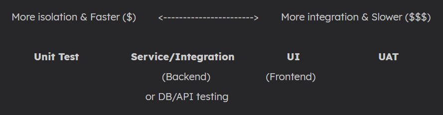
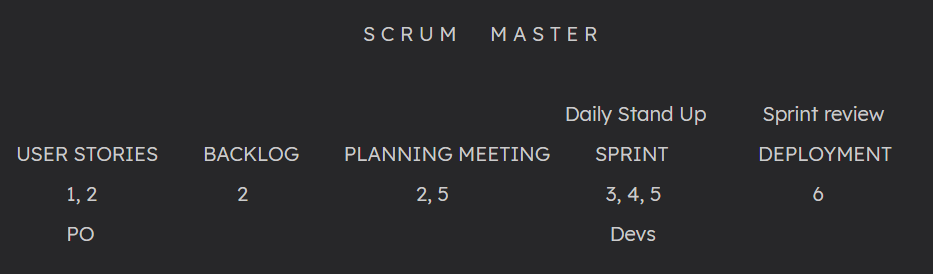
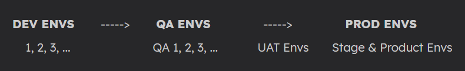

# TAG 1 - INTRO

### Habilidades técnicas

- Diseñar casos de pruebas
- Aplicar técnicas de testing
- Manehar un gestor de incidencias (**Jira**)
- Manejar un consultor de DB (**MySQL**)
- Manejar un consultor de APIs
- Aplicar un framework de automatización (**Selenium**)
- Manejar Git para CI/CD

Extras:

- Certificado ISTQB

### IT

- Desarrollo de SW
- Desarrollo Mobile/Web
- Videojuegos
- Analistas/ Consultores
- Sopote del usuario
- Infraestructura
- Calidad de SW (**QA**)
  - Tester
  - Analista
  - Ing. en automatización de pruebas
  - Especialista en seg. de la inf.

### Equipo de desarrollo

- Business analyst (BA)/ Product owner (PO)
- Product manager (PM)
- User Experience (UX)/ User Interface (UI)
- Developer (Dev)
- Test Automation Engineer (TAE)
- Quality Assurance (QA)

### Ciclo de vida del desarrollo de SW

Software Development Life Cicle (SDLC)

1. Planning (ROM)
2. Requeriment analysis
3. SW Design (Flow charts)
4. SQ Development (Coding)
5. **SW Testing (QA)**
6. Product release (or Deployment)
7. Maintenance

Los mov. entre fases se conocen como: *Deploy*

### Ciclo de vida de pruebas de SW

Software Testing Life Cicle (STLC)

1. Requeriment analysis
   - Test types
   - Priorities and focus
   - Requirements Traceability Matrix (RTM)
   - Test env details
   - Automation viability
2. Test planning
   - Test strategy
   - Efforts and costs
   - Limitations
3. Test design (test cases, scripts)
4. Env setup (programs)
5. Test execution
6. Closure (pass and fail reports)

*RTM: document that maps and traces user requirement with test cases.*

# TAG 2 - NIVELES DE TESTING

### Macro-types

- Functional (requirements)
- Non-functional (stress, performance)
- Maintenance

### Macro-levels

- Blackbox -> Vemos el código (Backend, Unit & Service levels)
- Graybox (Service level)
- Whitebox -> No vemos el código (Frontend, Service & UI levels)

### Levels (functional)

*UI: User Interface (se le presenta al usuario)* 

*UAT: User Acceptance Testing*

*API: Application Programming Interface*

*Un bus o una API puede verse como un medio para traernos información desde el backend hasta el frontend. Es decir, mueven información desde  'bases de datos' de nuestro SW.*

Nosotros **NO** hacemos **unit test**, lo hacen los developers.

El UAT lo hacen los clientes y el BA.

En todos los macro-niveles se puede decidir entre hacer testing manual y automatizado, pero se recomienda:

- Service -> Automatizado
- UI -> Manual y automatizado

# TAG 3 - TIPOS DE TESTING

### Non Functional

- Security
- Performance
- Load/ Stress
- Reliability
- Usability
- Availability

### Functional

- Exploratory                                                         -> UI, UAT

- UI (✔)                                                                  -> UI, UAT

- API (✔)                                                                -> Service

- DB (✔)                                                                 -> Service

- Strategic:

  - End-To-End **E2E** (✔)                                     -> It is DB, API & UI
  - Regression (✔)
    - Smoke (✖)
      - Sanity (✖)
  - Re-Testing (it is done after Devs debug something) 

  

*✔ Indicates that either manual or automated approach can be used.*

*✖ Indicates Unit testing, made only by Devs*

*UI Testing is also known as System testing, and represents roughly 80% of all QA's tests*

# TAG 4 - SCRUM

### Process

1. Initiation
2. Requirements definition
3. Design
4. Development
5. Test
6. Release
7. Maintenance

*Daily Scrum or Daily stand up is a 15 minutes meeting.*

*PBI: Product Backlog Item*

*La sprint (o sprint backlog) dura de 2 a 4 semanas.*

*Durante un sprint backlog se trabajan múltiples PBIs, cada uno de ellos, a su vez, con múltiples tareas.*

### Roles

- Product Owner (PO)
  - Decides what to build
  - Collects requirements
  - Defines user stories and MVP
  - Sets acceptance criteria
  - Prioritizes Backlog items
  - Validates releases in sprint review
- Scrum Master (SM)
  - Implements scrum
  - Solves obstacles in the team
- Dev Team (UX, QA & Devs)

 

### Ceremonias

- Sprint planning -> a measure of the needed efforts for a task to be done (stories/fibonacci points)
- Daily Scrum -> what are we gonna do today, do any have any obstacle?
- Sprint Review -> product is shown to the client
- Sprint Retrospective -> client liked/ disliked something; good things stay, bad ones don't, and new ideas will be implemented
- Sprint Grooming or Refinement -> trash things that didn't work out.

# TAG 5.1 - AMBIENTES DE TRABAJO

An environment is like a copy of the SUT.

Dev teams have their own envs (for backend and frontend) and QA teams have their own envs aswell (for Unit, API, DB and UI).

This allows them to work on different SW versions without conflicts.

*SUT: System under test*

Once tests have been done (QA Envs), a **deploy** is done to UAT env, for client validation.

After client UAT env, there's another deploy to Stage Env, which is a 'pre' and usually contains alpha, beta versions.

A final deploy is done to Prod, where product is ready to be used by final users.

# TAG 5.2 - ELEMENTOS UI

### General types

- **Input controls**: allow users to enter info into the system.
- **Navigational components**: help users move around a product or website.
- **Informational components**: share info with users.
- **Containers**: hold related content together.

### Elements

<table style="width: 100%; text-align: center; vertical-align: middle; border-collapse: collapse;">
    <thead>
        <tr>
            <th width="30%">Type</th>
            <th width="70%">Element</th>
        </tr>
    </thead>
    <tbody>
        <tr>
            <td>Input</td>
            <td>Button 
                Checkbox 
                Radio Buttons 
                Toogle 
                Dropdown 
                Search bar 
                Picker 
                Slider 
                Stepper
            </td>
        </tr>
        <tr>
            <td>Navigational</td>
            <td>Accordion 
                Pagination 
                Bento menu 
                Breadcrumb 
                Tab 
                Sidebar 
                Carousel
            </td>
        </tr>
        <tr>
            <td>Informational</td>
            <td>Comment 
                Loader 
                Tag 
                Tooltip
            </td>
        </tr>
        <tr>
            <td>Containers</td>
            <td>Card 
                Form 
                Moral
            </td>
        </tr>
    </tbody>
</table>

s