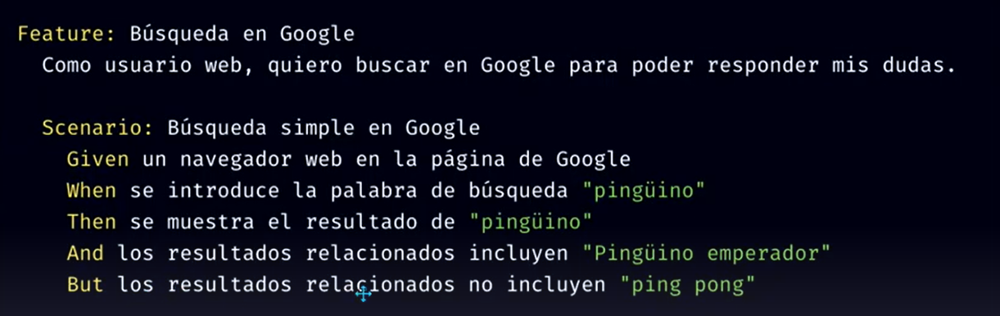

# 00 - Examples

### US



### Guerkin's keywords

> Use of `*` instead of `And` (or any other step keyword).

This:

```gherkin
Feature: .
Scenario: All done
  Given I am out shopping
  And I have eggs
  And I have milk
  And I have butter
  When I check my list
  Then I don't need anything
```

Could be expressed as:

```gherkin
Feature: .
Scenario: All done
  Given I am out shopping
  * I have eggs
  * I have milk
  * I have butter
  When I check my list
  Then I don't need anything
```


> Use of datatables

Data Tables are handy for passing a list of values to a step definition:

```gherkin
Feature: .
Scenario: .
 Given the following users exist:
  | name   | email              | twitter         |
  | Aslak  | aslak@cucumber.io  | @aslak_hellesoy |
  | Julien | julien@cucumber.io | @jbpros         |
  | Matt   | matt@cucumber.io   | @mattwynne      |
```


> Use of `Scenario outline`

Copying and pasting scenarios to use different values quickly becomes tedious and repetitive, for example:

```gherkin
Feature: .
Scenario: eat 5 out of 12
  Given there are 12 cucumbers
  When I eat 5 cucumbers
  Then I should have 7 cucumbers

Scenario: eat 5 out of 20
  Given there are 20 cucumbers
  When I eat 5 cucumbers
  Then I should have 15 cucumbers
```

We can collapse these two similar scenarios into a `Scenario Outline`, through the use of a template with `< >` delimited parameters

```gherkin
Feature: .
Scenario Outline: eating
  Given there are <start> cucumbers
  When I eat <eat> cucumbers
  Then I should have <left> cucumbers

  Examples:
    | start | eat | left |
    |    12 |   5 |    7 |
    |    20 |   5 |   15 |
```

> [!NOTE]
>
> The `Scenario Outline` is run *once for each row* in the `Examples` section beneath it.


# TAG 1 - INTRO

### Habilidades técnicas

- Diseñar casos de pruebas
- Aplicar técnicas de testing
- Manehar un gestor de incidencias (**Jira**)
- Manejar un consultor de DB (**MySQL**)
- Manejar un consultor de APIs
- Aplicar un framework de automatización (**Selenium**)
- Manejar Git para CI/CD

Extras:

- Certificado ISTQB

### IT

- Desarrollo de SW
- Desarrollo Mobile/Web
- Videojuegos
- Analistas/ Consultores
- Sopote del usuario
- Infraestructura
- Calidad de SW (**QA**)
  - Tester
  - Analista
  - Ing. en automatización de pruebas
  - Especialista en seg. de la inf.

### Equipo de desarrollo

- Business analyst (BA)/ Product owner (PO)
- Product manager (PM)
- User Experience (UX)/ User Interface (UI)
- Developer (Dev)
- Test Automation Engineer (TAE)
- Quality Assurance (QA)

### Ciclo de vida del desarrollo de SW

Software Development Life Cicle (SDLC)

1. Planning (ROM)
2. Requeriment analysis
3. SW Design (Flow charts)
4. SQ Development (Coding)
5. **SW Testing (QA)**
6. Product release (or Deployment)
7. Maintenance

Los mov. entre fases se conocen como: *Deploy*


### Ciclo de vida de pruebas de SW

Software Testing Life Cicle (STLC)

1. Requeriment analysis
   - Test types
   - Priorities and focus
   - Requirements Traceability Matrix (RTM)
   - Test env details
   - Automation viability
2. Test planning
   - Test strategy
   - Efforts and costs
   - Limitations
3. Test design (test cases, scripts)
4. Env setup (programs)
5. Test execution
6. Closure (pass and fail reports)


> [!NOTE]
>
> *RTM: document that maps and traces user requirement with test cases.*


# TAG 2 - NIVELES DE TESTING

### Macro-types

- Functional (requirements)
- Non-functional (stress, performance)
- Maintenance

### Macro-levels

- Whitebox -> Vemos el código (Backend, Unit & Service levels) "Vemos la luz"
- Graybox (Service level)
- Blackbox -> No vemos el código (Frontend, Service & UI levels) "No vemos la luz"

### Levels (functional)


> [!NOTE]
>
> *UI: User Interface (se le presenta al usuario)* 
>
> *UAT: User Acceptance Testing*
>
> *API: Application Programming Interface*
>
> *Un bus o una API puede verse como un medio para traernos información desde el backend hasta el frontend. Es decir, mueven información desde  'bases de datos' de nuestro SW.*


Nosotros **NO** hacemos **unit test**, lo hacen los developers.

El UAT lo hacen los clientes y el BA.


> [!TIP]
>
> En todos los macro-niveles se puede decidir entre hacer testing manual y automatizado, pero se recomienda:
>
> - Service -> Automatizado
> - UI -> Manual y automatizado
>


# TAG 3 - TIPOS DE TESTING

### Non Functional

- Security
- Performance
- Load/ Stress
- Reliability
- Usability
- Availability

### Functional

- Exploratory                                                         -> UI, UAT

- UI (✔)                                                                  -> UI, UAT

- API (✔)                                                                -> Service

- DB (✔)                                                                 -> Service

- Strategic:

  - End-To-End **E2E** (✔)                                     -> It is DB, API & UI
  - Regression (✔)
    - Smoke (✖)
      - Sanity (✖)
  - Re-Testing (it is done after Devs debug something) 

  

> [!NOTE]
>
> *✔ Indicates that either manual or automated approach can be used.*
>
> *✖ Indicates Unit testing, made only by Devs*
>
> *UI Testing is also known as System testing, and represents roughly 80% of all QA's tests*


# TAG 4 - SCRUM

### Process

1. Initiation
2. Requirements definition
3. Design
4. Development
5. Test
6. Release
7. Maintenance


> [!NOTE]
>
> *Daily Scrum or Daily stand up is a 15 minutes meeting.*
>
> *PBI: Product Backlog Item*
>
> *La sprint (o sprint backlog) dura de 2 a 4 semanas.*
>
> *Durante un sprint backlog se trabajan múltiples PBIs, cada uno de ellos, a su vez, con múltiples tareas.*


### Roles

- Product Owner (PO)
  - Decides what to build
  - Collects requirements
  - Defines user stories and MVP
  - Sets acceptance criteria
  - Prioritizes Backlog items
  - Validates releases in sprint review
- Scrum Master (SM)
  - Implements scrum
  - Solves obstacles in the team
- Dev Team (UX, QA & Devs)

 

### Ceremonias

- Sprint planning -> a measure of the needed efforts for a task to be done (stories/fibonacci points)
- Daily Scrum -> what are we gonna do today, do any have any obstacle?
- Sprint Review -> product is shown to the client
- Sprint Retrospective -> client liked/ disliked something; good things stay, bad ones don't, and new ideas will be implemented
- Sprint Grooming or Refinement -> trash things that didn't work out.


# TAG 5.1 - AMBIENTES DE TRABAJO

An environment is like a copy of the SUT.

Dev teams have their own envs (for backend and frontend) and QA teams have their own envs aswell (for Unit, API, DB and UI).

This allows them to work on different SW versions without conflicts.


*SUT: System under test*


Once tests have been done (QA Envs), a **deploy** is done to UAT env, for client validation.

After client UAT env, there's another deploy to Stage Env, which is a 'pre' and usually contains alpha, beta versions.

A final deploy is done to Prod, where product is ready to be used by final users.


# TAG 5.2 - ELEMENTOS UI

### General types

- **Input controls**: allow users to enter info into the system.
- **Navigational components**: help users move around a product or website.
- **Informational components**: share info with users.
- **Containers**: hold related content together.

### Elements

<table style="width: 100%; text-align: center; vertical-align: middle; border-collapse: collapse;">
    <thead>
        <tr>
            <th width="30%">Type</th>
            <th width="70%">Element</th>
        </tr>
    </thead>
    <tbody>
        <tr>
            <td>Input</td>
            <td>Button<br>
                Checkbox<br>
                Radio Buttons<br>
                Toogle<br>
                Dropdown<br>
                Search bar<br>
                Picker<br>
                Slider<br>
                Stepper
            </td>
        </tr>
        <tr>
            <td>Navigational</td>
            <td>Accordion<br>
                Pagination<br>
                Bento menu<br>
                Breadcrumb<br>
                Tab<br>
                Sidebar<br>
                Carousel
            </td>
        </tr>
        <tr>
            <td>Informational</td>
            <td>Comment<br>
                Loader<br>
                Tag<br>
                Tooltip
            </td>
        </tr>
        <tr>
            <td>Containers</td>
            <td>Card<br>
                Form<br>
                Moral
            </td>
        </tr>
    </tbody>
</table>


# TAG 6, 7 - INCIDENCIAS

### Issues

En Jira, las partes de un trabajo se denominan “incidencias”. Hay diferentes tipos de incidencias, como:

- las historias de usuario,
- los errores,
- y las tareas.

Así pues, la incidencia puede ser una tarea del proyecto, un formulario de solicitud o cualquier otra unidad de trabajo relevante del proyecto.


### Initiatives (INIT)

An initiative is the origin of a feature and, in turn, of epics. They aren't shown in Jira.

Initiative -> Epic -> Stories


### Features

It's a functionality of the SUT.

It can be either an Epic or a user Story.

Examples:

- Login page (epic)
- Button (story)


### Types of issues

Epic -> Stories -> Tasks


> EPIC

Una funcionalidad completa.

A big user story that needs to be broken down (a collection of related error, stories and tasks).

An epic can also be seen as a new feature, which comes with multiple tasks in order to be developed.

> USER STORIES (US)

Es una feature específica, que puede depender de otras o ser parte complementaria de una feature más grande (epic).

Son creadas por el BA/PO, que son los analistas de software, y las ponen en el backlog.


### User stories

<table style="width: 100%; text-align: center; vertical-align: middle; border-collapse: collapse;">
    <thead>
        <tr>
            <th width="50%">Characteristic</th>
            <th width="50%">Definition</th>
        </tr>
    </thead>
    <tbody>
        <tr>
            <td>Description</td>
            <td>As [user x],<br>
                I want [functionality],<br>
                so that [benefit]
            </td>
        </tr>
        <tr>
            <td>Acceptance Criteria (AC)</td>
            <td>Given [things],<br>
                for when [an action is taken],<br>
                then [desired outcome]
            </td>
        </tr>
        <tr>
            <td>Scope and Out Of Scope (OOS)</td>
            <td>'Just test THIS'<br>
                What we should focus in, to avoid reporting bugs outside of the scope.
            </td>
        </tr>
        <tr>
            <td>Business rules (BR)</td>
            <td>Specific descriptions<br>
                Example: behavior of a credit card for A) teenagers under 18 and B) old people
            </td>
        </tr>
        <tr>
            <td>Priority</td>
        </tr>
        <tr>
            <td>Story Points (SP)</td>
        </tr>
    </tbody>
</table>


#### Acceptance criteria (AC)

They are written in 3rd person, using 'user' and 'system' clearly.

Based on our analysis of a single acceptance criteria, we will decide if to generate one or multiple test cases.

##### Behavior Driven-Development (BDD)

It's a model to work with requirements. It's not a technique, but more like a document format.

They are used in User Stories, Coding and Tests Cases.

They use the requirements language **Gherkin**.

##### Guerkin

It's a Reqs. Language, not a programming language.

Guerkin = BDD model = **Cucumber** framework


When using Gherkin, we follow these principles:

- **Feature:** `Feature:` functionality
- **Scenario:** `Scenario:` or `Example:` user objective (becomes the 'test case title')
  - **Background:** `Background:` indicates there's only a single 'given' for a group of scenarios (sintaxis to group duplicated 'Given')
  - **Scenario outline:** `Scenario outline:` this keyword can be used to run the same Scenario multiple times, with different combinations of values.
- **Conditionals:**
  - `Given` (context, test pre-conditions)
  - `When` (event or action, test steps)
  - `Then` (expected system result)
- **Conditionals extensions:**
  - `And` (new condition)
  - `But` (opposite condition) 


Example:

```gherkin
Feature: Búsqueda en Google.
Como usuario web, quiero buscar en Google para poder responder mis dudas.
Scenario: Búsqueda simple en Google
	Given un navegador web en la página de Google
	When se introduce la palabra de búsqueda "pingüino"
	Then se muestra el resultado de "pingüino"
	And los resultados relacionados incluyen "Pingüino emperador"
	But los resultados relacionados no incluyen "ping pong"
```


# JIRA

### Capacidades

- Creación de requerimientos (features)
- Creación y seguimiento de incidencias (issues)
- Gestión de códigos (GITs, DEVOPS)
- Gestión de pruebas (test management: Xray - Testing board)
- Gestión de tareas (task management)
- Gestión de reportes

### Xray issues

> TEST SET

Colección de casos de prueba agrupados para un propósito específico, pero que se pueden ejecutar en diferentes entornos.

> TEST

Representa un **caso de prueba**. Contiene los pasos específicos (manuales o automatizados) para validar una funcionalidad o comportamiento del software.

> TEST EXECUTION

Registro de los resultados del test (pasó, falló, bloqueado) e info de cuándo se ejecutó, quién lo ejecutó, y qué entorno se utilizó.

> BUG

Falla en el software que causa un resultado inesperado (errores en el código, errores de configuración o problemas con el entorno).

> PRECONDITION (not exactly an issue, but a tool)

Condición que debe cumplirse antes de que se pueda ejecutar un caso de prueba (requisitos de hardware o software, configuraciones específicas o datos de prueba).

> TEST PLAN (not exactly an issue, but a tool)

Documento que describe cómo se probará el software (alcance y tipos de las pruebas que se realizarán, recursos necesarios y cronograma).


### Priority levels

1. **Highest**: will block progress
2. **High**: could block progress
3. **Medium**: potential to affect progress
4. **Low**: easily worked around.
5. **Lowest**: no impact on progress


### Statuses in Kanban Board

> COMMON WORKFLOW (KANBAN)

1. To do

2. In progress

3. Done


> MORE STATUSES

- **Open**:  ready for the assignee to start work on it.
- **In progress**
- **Reopened**: issue was once resolved, but the resolution was deemed incorrect.
- **Resolved**: awaiting verification. From here, it can be reopened or closed.
- **Closed**: resolution was correct.
- **Building**: waiting for the code to be built before moving to the next status.


### Configure an issue

> CREATE A NEW FIELD

Issues 'template' can have more info, for example:

- Number
- Time stamp
- Labels
- Due date/ Start date


### The reporter

The reporter is usually the person who created the issue.


### Manage workflows

> #### TRANSITIONS

Transitions connect statuses.

Like, from 'Ready for pickup' to 'Send for delivery' and then to 'On the way' statuses.

> RULES

A rule can be set to:

- **Assign an issue to someone at different stages of the process**

  To ensure that the right people address the right issues at the right time.

- **Restrictions based on an specific value**

  To verify that an issue's field meets an specific value condition (a number, a date, a content) before allowing someone to move the issue to another status.

- **Restrictions based on statuses**

  To ensure that issues go through one or more required stages.

- **Restrictions based on users permissions**

  To ensure only the right people can move an issue at a particular point in your team’s process.


### Boards

You're asked to select a template when creating a project, which, in turn, will define the board type.

- Kanban
- Scrum
- Bug tracking

For QA, a board usually consists of:

Deployed in QA -> Working on -> Work validation -> Work done -> Deployed in UAT


### Filters

They are like mini SQL queries, to select issues.


# TAG 10 - TEST CASES

### Crear un Test Case

1. Entender la descripción de la US.

2. Dentro de la US en Jira+XRay, desplazarse hasta abajo, en 'Test Coverage'

3. Click en 'Add tests' -> 'New test'

4. **Summary:** siempre comienza con la palabra 'validar' ('check') y el scenario de la US reescrito con el verbo de acción en <u>infinitivo</u>.

   Por ejemplo:

   US Scenario: 'Usuario añade un producto simple del PLP al Shopping-Cart exitosamente'

   Test Summary: 'Validar añadir un producto simple del PLP al Shopping-Cart exitosamente'

5. **Preconditions:** las precondiciones no tienen 'expected result'.

6. **Test details:** pueden ser escritos en 'manual', en 'cucumber' o en 'scenario'.

7. Click en 'Add step'

8. **Edit Step:**

   ACTION: Se puede tomar del 'when' de la US, escribiéndolo en infinitivo. Por ejemplo: 'click en...'

   EXPECTED RESULT: Se puede tomar del 'then', escribiéndo '<u>should</u>'. Por ejemplo: 'debería aparecer...'

   > [!TIP]
   >
   > Una acción puede tener múltiples 'Expected results', en forma de viñetas. Esto se puede identificar cuando hay condiciones 'And' en la US.

9. s


> [!NOTE]
>
> *PLP: Product listing page*
>
> *PDP: Product detail page*


#### Ejemplo de AC y Test Casa

##### AC

```gherkin
ACCEPTANCE CRITERIA
#ESCENARIO 1 (HAPPY PATH)
Feature: X
Scenario: Usuario añade un producto simple del PLP al Shopping-Cart exitosamente
GIVEN: el usuario se sitúe en el PLP
When hace click sobre el botón "Add To Cart" ubicado en la parte inferior de las Cartas Simples de la PLP
Then encima de la imagen del Producto Simple elegido, aparece un mensaje de loading por unos segundos: "ADDING TO CART..."
And luego en su lugar, aparece otro mensaje por unos segundos de que el producto ha sido añadido exitosamente:
"SUCCESSFULLY ADDED TO YOUR SHOPPING CART"
And encima del Listado de Productos aparece un ícono de shopping-cart y un mensaje de tipo banner indicando: "View Cart Product successfully added to your cart."
And dentro del mensaje, se visualiza un enlace en la palabra "View Cart"
```

> [!NOTE]
>
> Gherkin highlighting doesn't work in Typora (even though it does on Github) if 'Feature: ' line isn't found in the code fence.

##### Test Case

```gherkin
Feature: Búsqueda en Google
Como usuario web, quiero buscar en Google para poder responder mis dudas.
Scenario: Búsqueda simple en Google
Given un navegador web en la página de Google
When se introduce la palabra de búsqueda "pingüino"
Then se muestra el resultado de "pingüino"
And los resultados relacionados incluyen "Pingüino emperador"
But los resultados relacionados no incluyen "ping pong"

Expected Result
Should aparecer un mensaje de loading por unos segundos: "ADDING TO CART" encima
de la imagen del Producto Simple elegido.
Debería aparecer otro mensaje por unos segundos de que el producto ha sido añadido
exitosamente: "SUCCESSFULLY ADDED TO YOUR SHOPPING CART"
• Debería aparecer un icono de shopping-cart y un mensaje de tipo banner indicando: "View
Cart Product successfully added to your cart." encima del PLP.
• Debería visualizarse un enlace en la palabra "View Cart"
```


```gherkin
Feature: Búsqueda en Google

Scenario Outline: eating
  Given there are <start> cucumbers
  When I eat <eat> cucumbers
  Then I should have <left> cucumbers

  Examples:
    | start | eat | left |
    |    12 |   5 |    7 |
    |    20 |   5 |   15 |
```

